# Personal Budget Tracker

A Flutter budgeting app built around real-world envelope budgeting. Instead of just logging expenses
against static numbers, it models money like physical cash: income flows into an **Unallocated Funds** pool, gets intentionally assigned to category envelopes each month, and every single move is
recorded as an auditable ledger entry rather than a silently updated total.

I built this as a personal project right before starting uni. I wanted to build healthier
financial habits, and frankly, I figured: why settle for a boring Excel sheet when I can build
something better? It turned out to be the perfect opportunity to get my finances in order while
diving deep into Flutter, Dart, and sound application architecture. I'm sharing it open-source for
anyone looking for a more deliberate way to budget.

## What it does

- **True envelope budgeting** — Money flows from Income → Unallocated Funds → Category Budgets →
  Expenses. Every movement creates a `Transfer` entry, so you always have a full audit trail.
- **Separated savings** — Savings sit in a dedicated pool that you can only reach through
  Unallocated Funds. Putting money aside takes a deliberate step, keeping it safe from everyday
  impulse spending.
- **Predicted vs. actual spending** — Log upcoming costs ahead of time. You can confirm, tweak, or
  cancel them as the date gets closer, making it easy to see what you've spent versus what you
  *plan* to spend.
- **Smart month-closing** — Months automatically wrap up two months after they end, sweeping
  leftover funds back to your Unallocated pool. If you forget to log a late receipt, you can reopen
  any closed month within a 2-year window.
- **Flexible categories** — Add, rename, or delete categories on the fly. Deleting a category
  automatically moves its past transaction history into a built-in "Other" bucket so your historical
  records stay intact.
- **Overspend guardrails** — If an expense pushes a category into the red, the app prompts you to
  cover the gap from Unallocated Funds—or blocks the entry if your pool is empty.
- **Personalized look & feel** — Full light/dark/system theme support with various accent colors and
  customizable date formats, all saved locally.

## Screenshots

### Home & navigation

**Home screen**
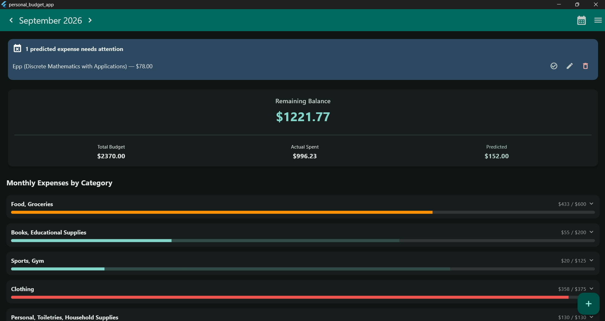

**Monthly transaction history for a category**
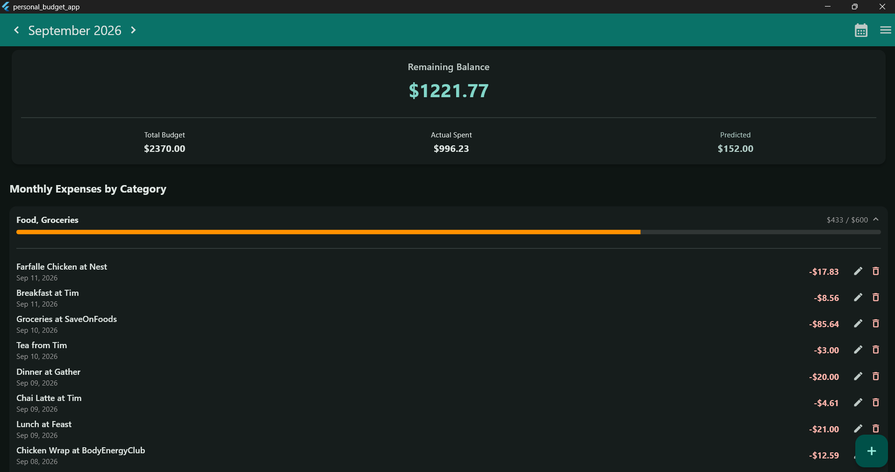

**Menu**
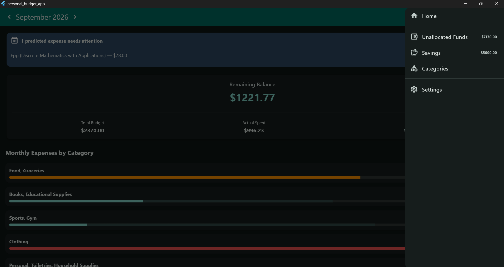

**Add Income**
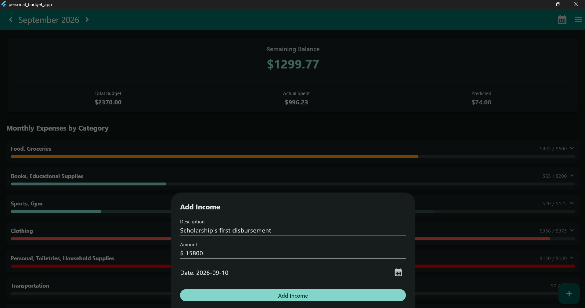

**Add Expense**
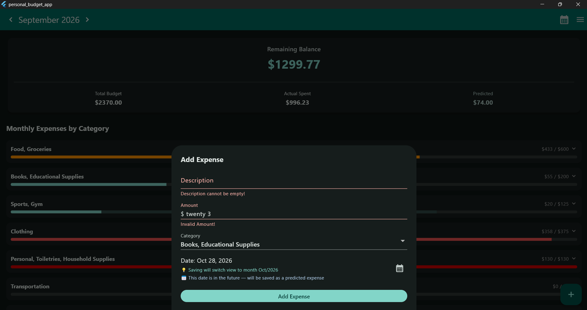

### Month lifecycle

**Wrap up month**
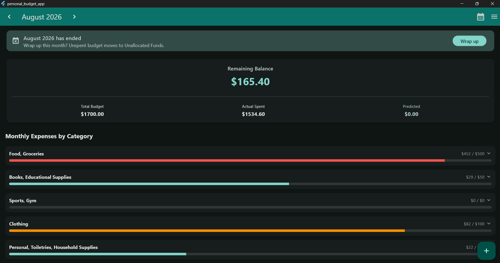

**Month closed**
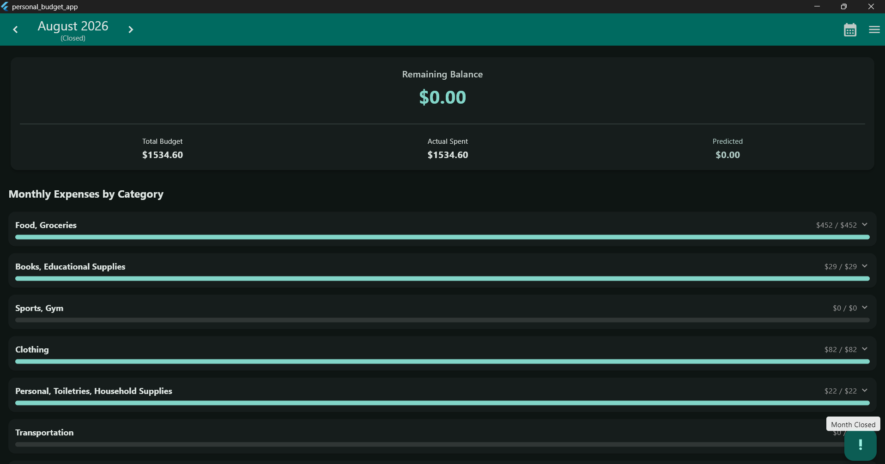

**Reopen month**
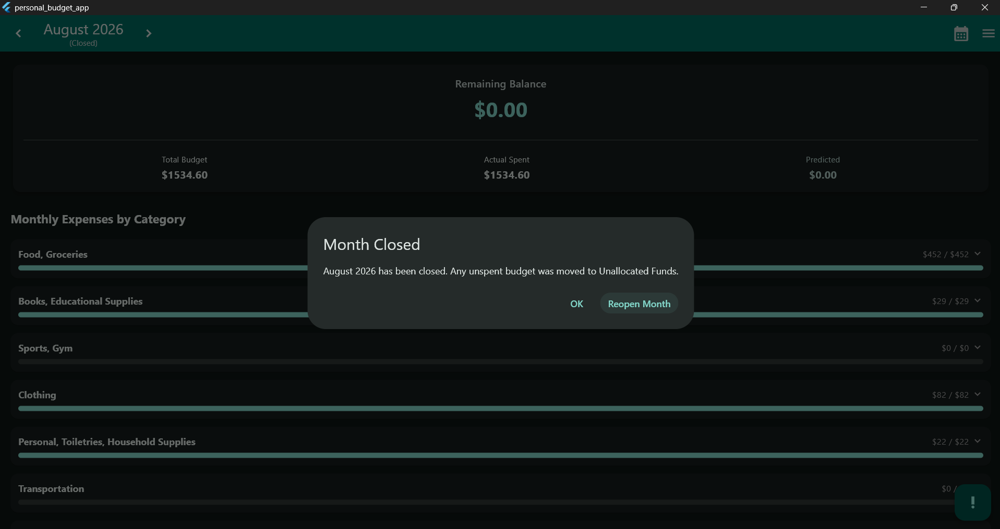

### Budget guardrails

**Overbudget — cover shortfall**
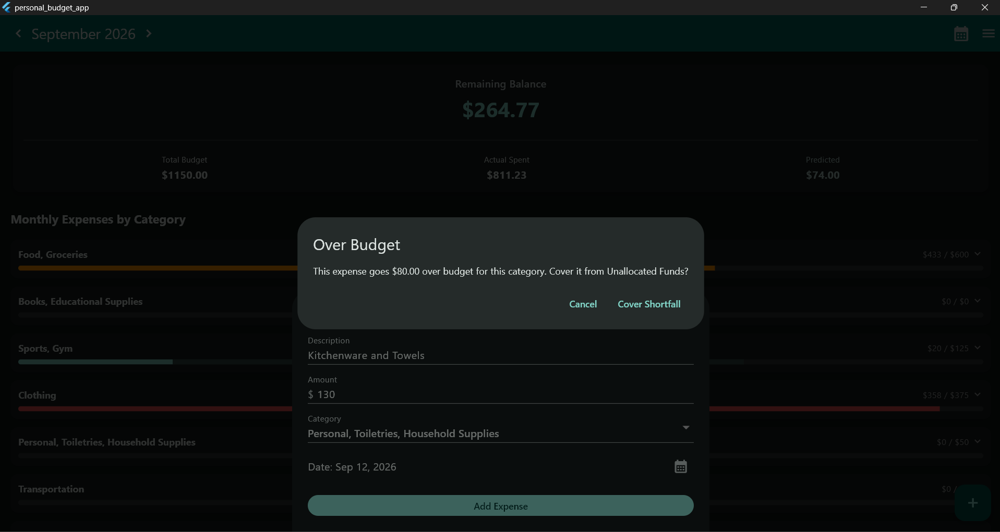

**Overbudget — predicted expense**
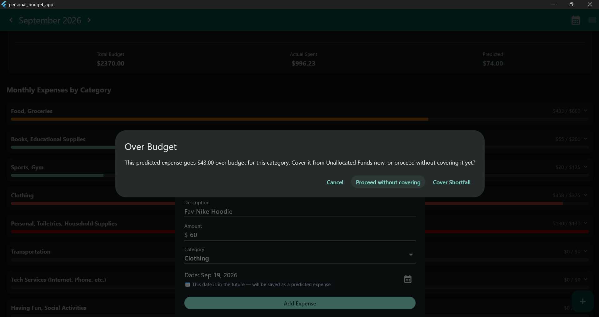

**Overbudget — can't cover**
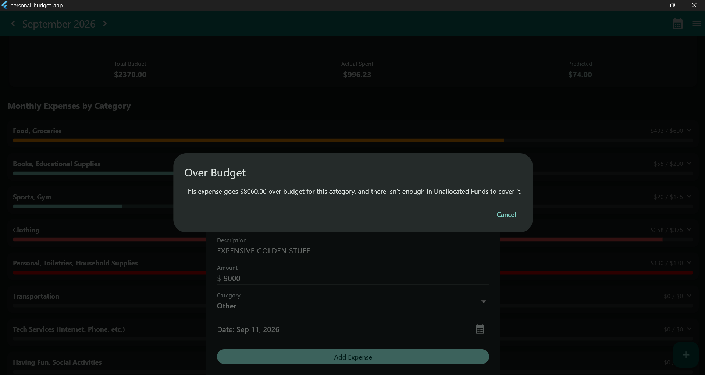

### Categories

**Categories screen**
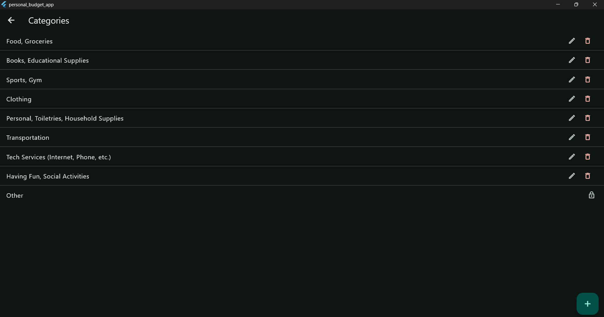

**Renaming a category**
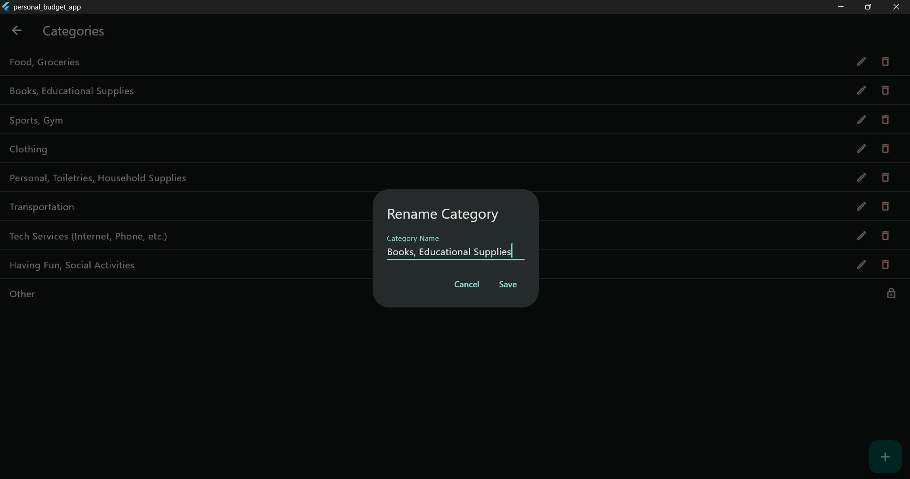

**Deleting a category**
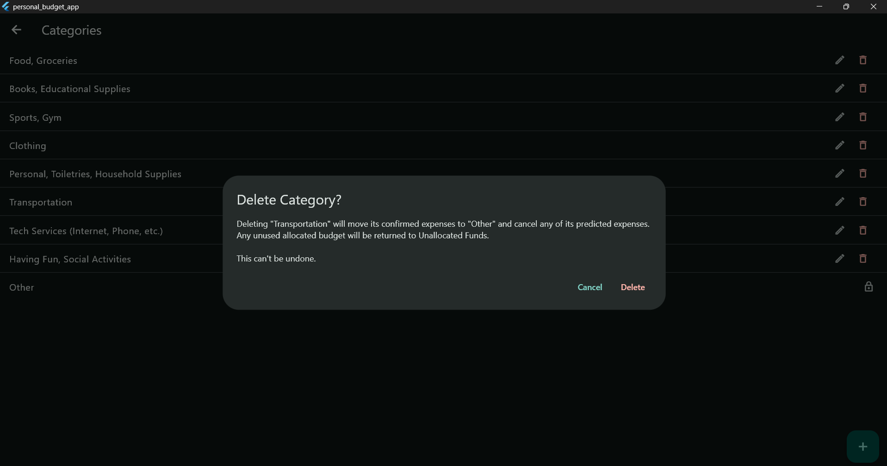

**Duplicate category name**
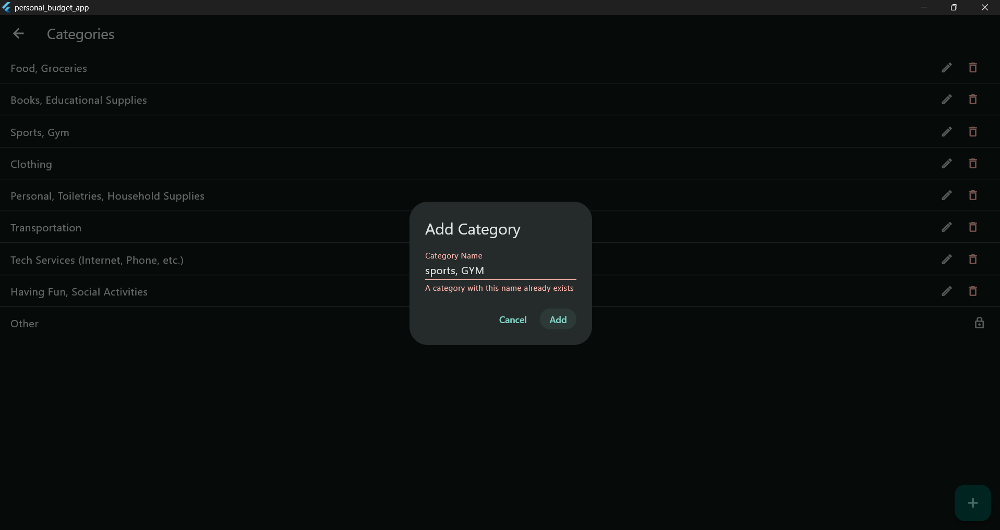

### Other Screens

**Unallocated Funds**
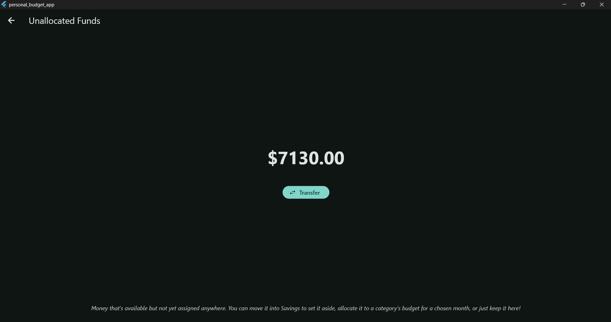

**Savings**
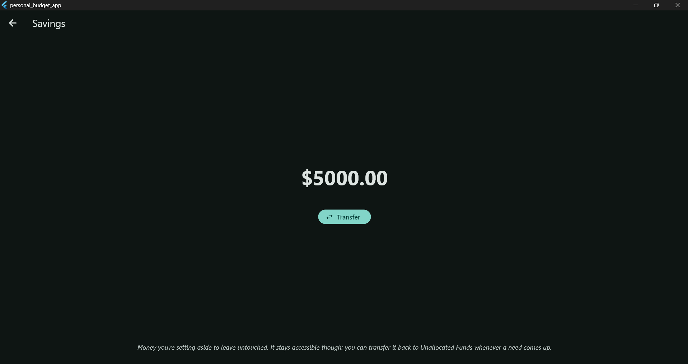

**Settings**
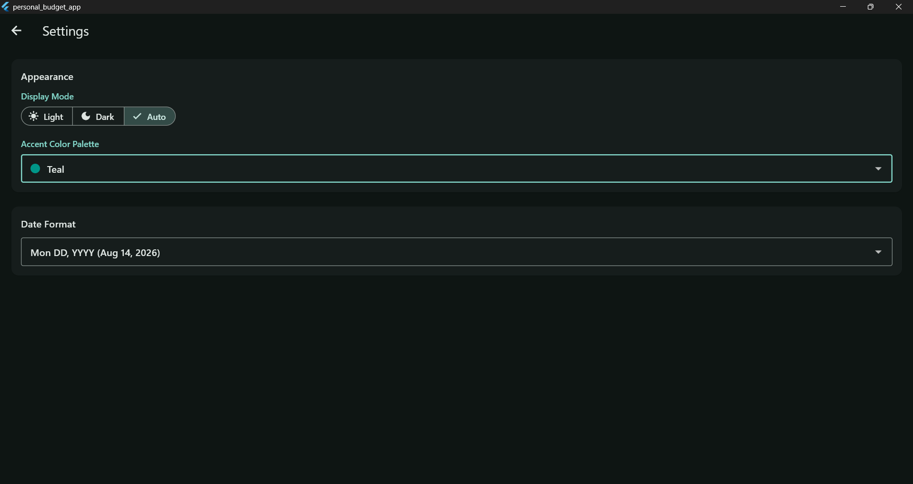

## What's next

This project is actively evolving. Here is what I'm planning to tackle next:

- Responsive, adaptive layouts for tablets and mobile phone screens
- Multi-currency support
- Visual spending trends and historical analytics per category
- Preset category templates tailored for common lifestyles (students, employee, family, etc.)

## Tech stack

- **Framework:** Flutter (3.41.5) & Dart (3.11.3)
- **Persistence:** `path_provider`, `shared_preferences`
- No backend, no API keys — all data is stored locally on-device and nothing is synced or backed up
  automatically.

## Getting started

```bash
flutter pub get
flutter run
```
